# 绘语AI

<p align="center">
    
</p>
<p align="center">
    
    
    
    
    
    
</p>



## 绘语AI 是什么？

绘语AI是一套面向普通用户，提供 Stable Diffusion AI绘画功能的程序，现已支持微信小程序端，并有完善的Web后台管理界面。

模块结构分为：

- **后端服务 - 本仓库**
- [uniapp用户端（已支持微信小程序）](https://github.com/HuiyuAI/huiyu-uniapp)
- [Web后台管理](https://github.com/HuiyuAI/huiyu-web-admin)
- [SD调用端（对接 Stable Diffusion API 的程序）](https://github.com/HuiyuAI/huiyu-sdapi)



## 功能预览

微信小程序端：

|            首页             |            画夹             |            广场             |            我的             |
| :-------------------------: | :-------------------------: | :-------------------------: | :-------------------------: |
| 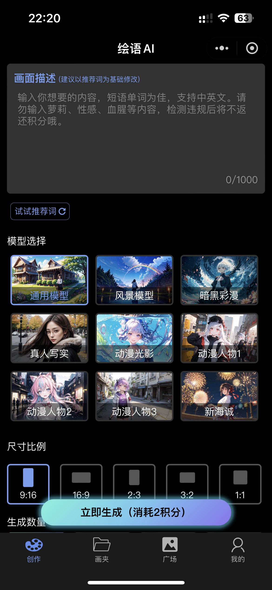 | 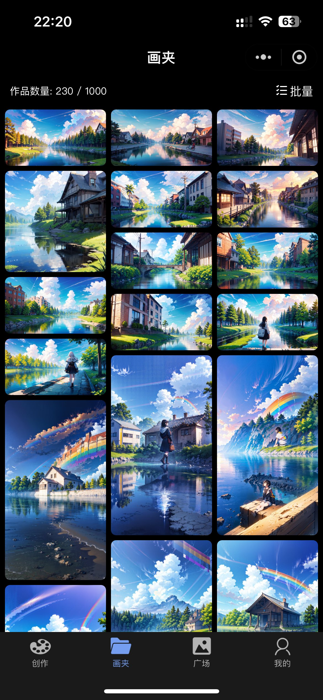 | 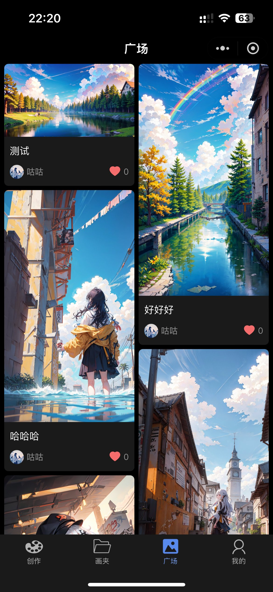 | 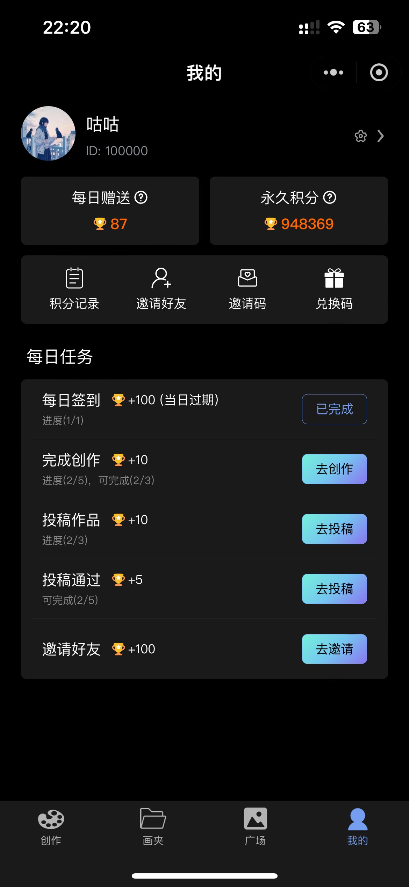 |
|      **画夹作品详情**       |      **广场作品详情**       |        **积分记录**         |        **个人信息**         |
| 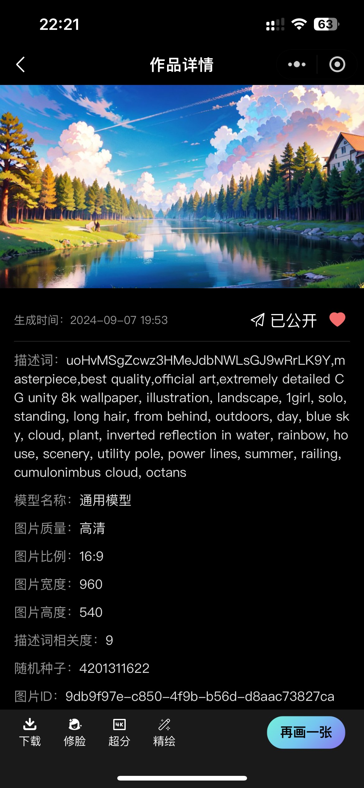 | 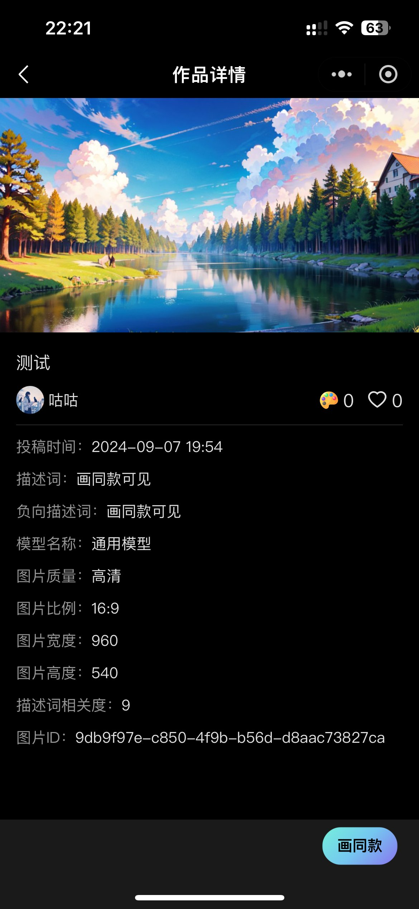 | 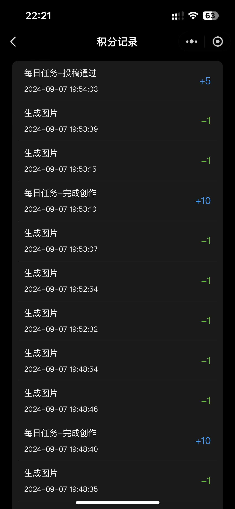 |  |



Web管理端：

| 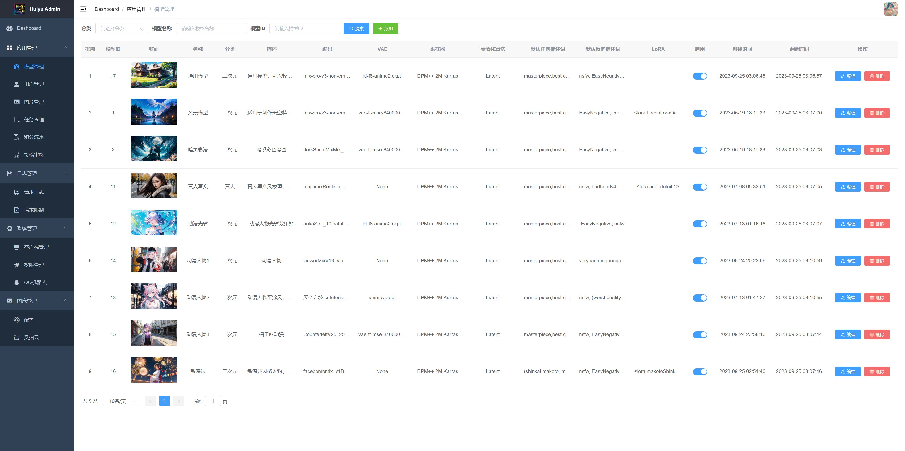  | 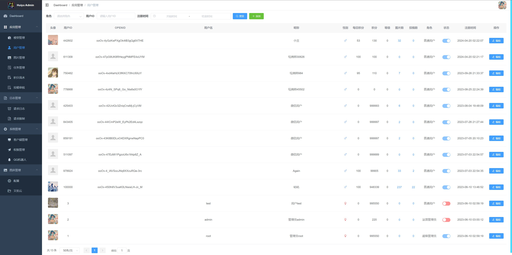  |
| ---------------------- | ---------------------- |
| 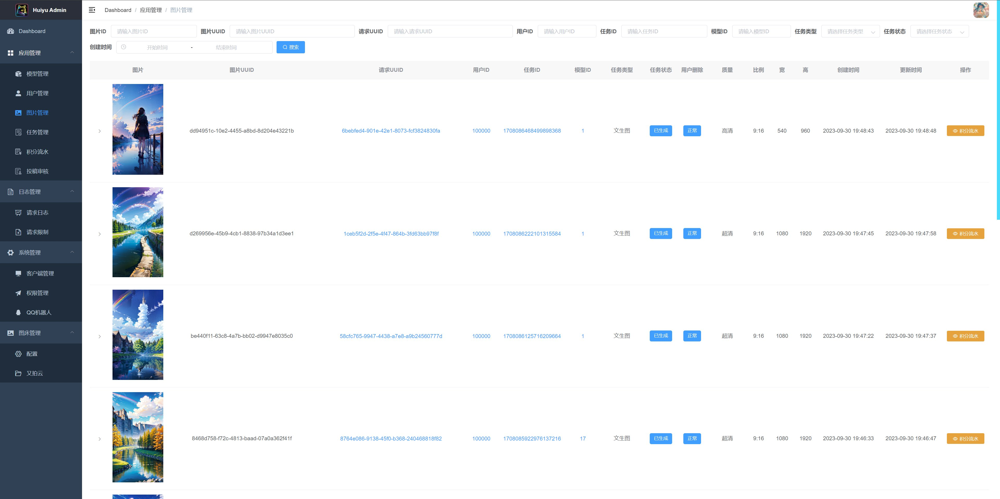  |   |
|   | 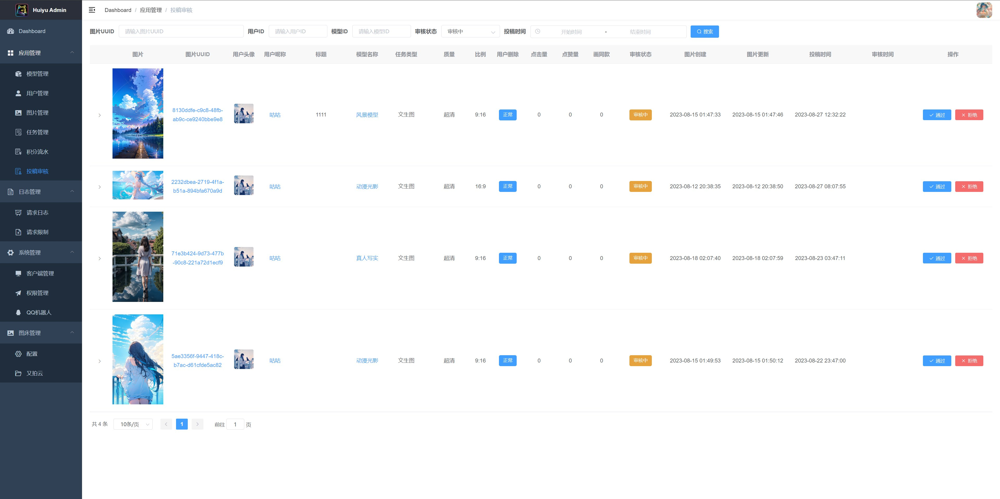  |
| 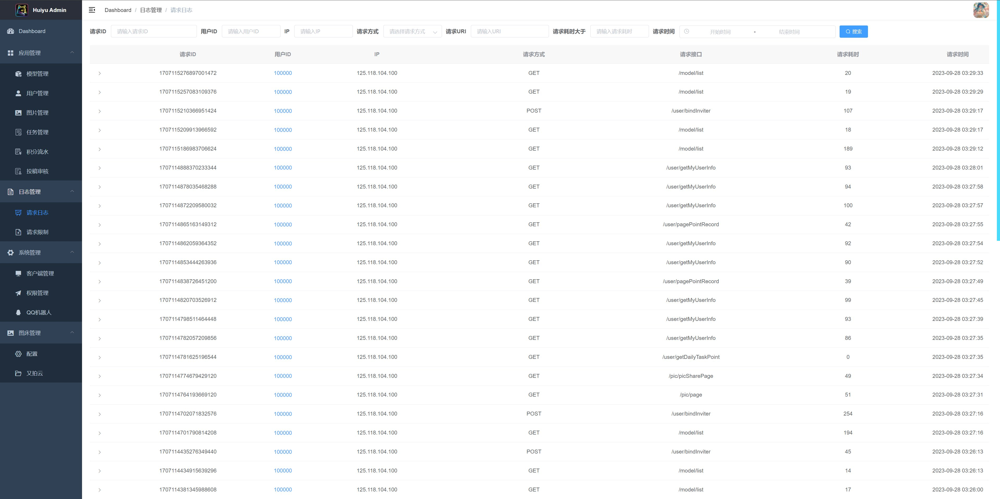  | 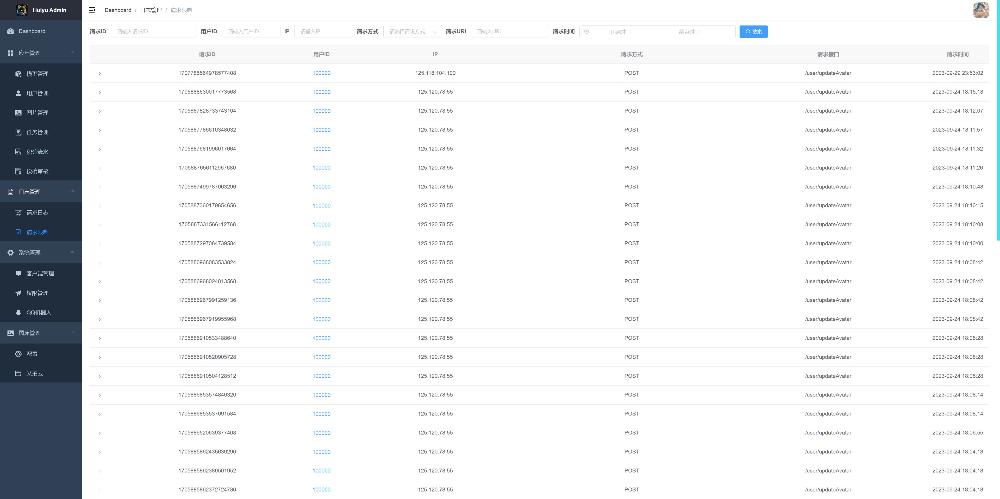  |
| 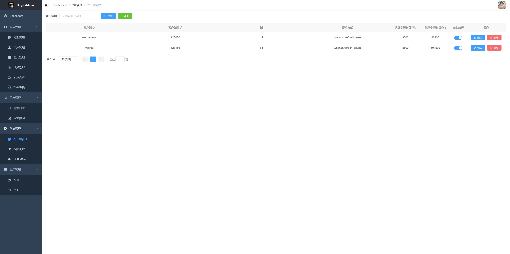  | 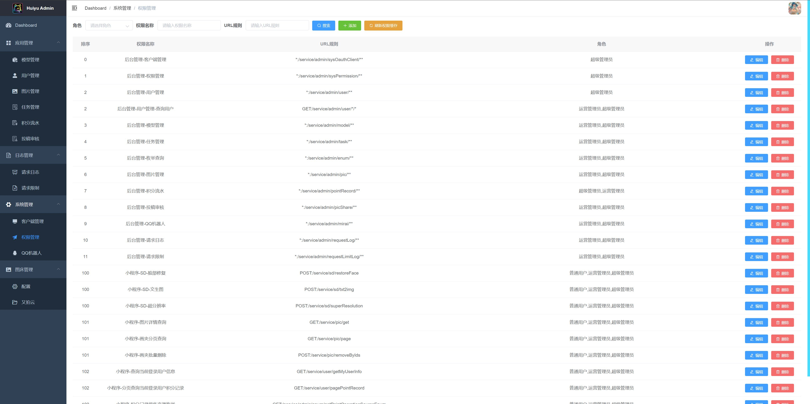 |
| 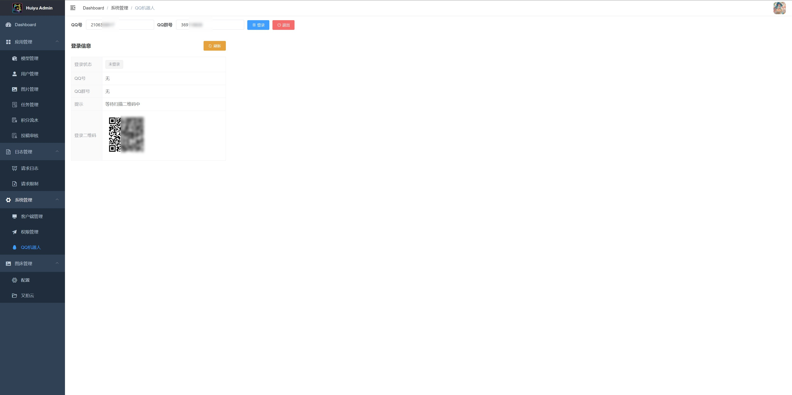 |  |



QQ机器人功能预览：

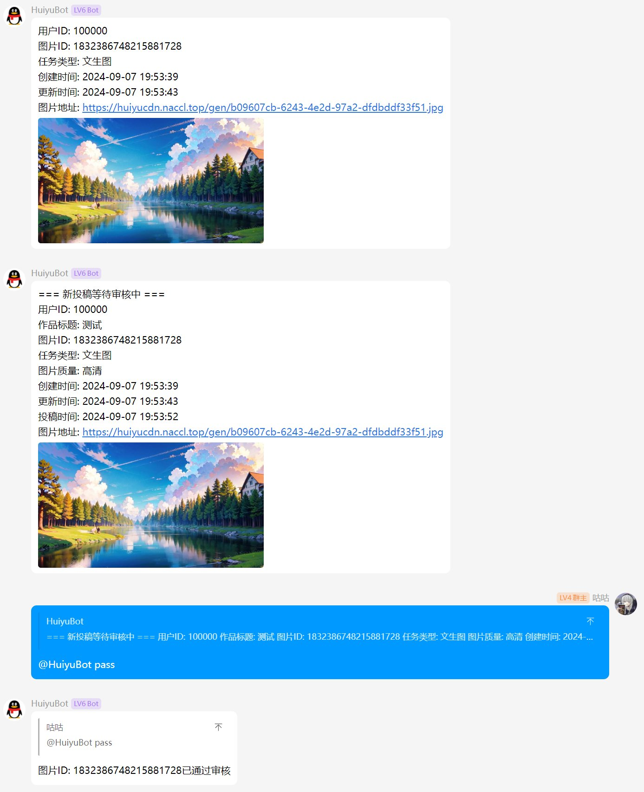



## 功能特性

- [x] 基于 Oauth2 认证，可拓展不同平台（如抖音小程序），已支持微信小程序 openid 认证，Web后台管理用户名密码登录，支持 token 自动续签
- [x] 支持角色权限控制，如超级管理员、运营管理员、普通用户，可配置不同资源的访问权限
- [x] 用户生图需消耗积分，积分分为每日积分和永久积分，每日积分有上限且自动优先使用，每日签到可获赠每日积分，邀请新用户可获赠永久积分，生图失败回退积分
- [x] 支持文生图、面部修复、高清化放大
- [x] 小程序瀑布流懒加载
- [x] Web后台可配置SD模型、LoRA、VAE、采样器、默认提示词等参数
- [x] 用户可投稿图片至广场获取积分奖励，其他用户可画同款图片获取该图提示词及各项参数
- [x] 投稿有审核机制，运营管理员可在Web后台通过或拒绝
- [x] 已接入 [mirai](https://github.com/mamoe/mirai) QQ机器人，用户生图、投稿时会向QQ群内推送消息及图片，管理员回复该消息可快捷审核
- [x] 已接入[腾讯云TMT机器翻译](https://cloud.tencent.com/product/tmt)接口，支持对用户输入的生图提示词中英翻译，支持多个云账户负载均衡，支持匹配预定义的热门词（也可以搭配 [prompt-translator](https://github.com/Naccl/prompt-translator) 进行本地机器翻译）
- [x] 已接入[又拍云](https://www.upyun.com/)作为用户生图、头像的云存储
- [x] 支持微信文本审核接口检测用户输入的违禁词
- [x] 支持微信图片合规接口检测用户生成的图片
- [x] 支持参数热配，如每日任务的奖励积分
- [x] 支持多 Stable Diffusion 实例按执行压力负载均衡，支持动态上下线
- [x] 请求日志、请求频率限制
- [x] 支持 Prometheus 监控一些主要接口耗时数据



#### ~~后期计划~~

- [ ] 充值积分、通过兑换码兑换积分
- [ ] 提示词支持从咒语书中选择，推荐随机提示词
- [ ] 图生图
- [ ] 抖音小程序（虽然是uniapp开发，但还是需要针对抖音平台作调整）
- [ ] 接入其它云存储
- [ ] 仪表盘数据
- [ ] 支持SDXL



项目已进入归档阶段，没有后续功能开发计划，但随缘支持 PR



## 快速开始

> [!NOTE]
>
> 如需完整运行所有模块，强烈建议有 Stable Diffusion 相关的安装、使用经验者尝试
>
> 以下仅包括**后端服务 - 本仓库**的运行方式，其它模块请看：
>
> - [uniapp用户端](https://github.com/HuiyuAI/huiyu-uniapp)
> - [Web后台管理](https://github.com/HuiyuAI/huiyu-web-admin)
> - [SD调用端](https://github.com/HuiyuAI/huiyu-sdapi)

1. 创建 MySQL 数据库 `huiyu` 并导入项目目录下的 `huiyu.sql`
2. 执行项目目录下的 Python 脚本 `user_id_sender.py` （修改代码中数据库账密），用于向数据库中插入用户注册时的随机ID发号表
3. 项目需要用到 nacos，修改 `huiyu-auth, huiyu-gateway, service-core` 对应 `bootstrap-dev.yml` 文件中的连接地址和账号密码

<details>
  <summary>点击展开nacos配置</summary>

在 nacos 中添加以下 5 个配置（注释部分改成自己的）：

a. Data ID: `huiyu-auth-dev.yml` , Group: `DEFAULT_GROUP` , Type: `YAML`

```yaml
wechat:
  miniapp:
    config:
      appid: wx123456789
      secret: xxxxxxxxxxxxx # 在微信小程序平台的AppID、AppSecret
```

b. Data ID: `huiyu-gateway-dev.yml` , Group: `DEFAULT_GROUP` , Type: `YAML`

```yaml
spring:
  redis:
    host: localhost
    port: 6379
    password: 123456
    database: 0 # 修改redis连接
```

c. Data ID: `huiyu-service-dev.yml` , Group: `DEFAULT_GROUP` , Type: `YAML`

```yaml
spring:
  datasource:
    type: com.alibaba.druid.pool.DruidDataSource
    driver-class-name: com.mysql.cj.jdbc.Driver
    url: jdbc:mysql://localhost:3306/huiyu?useUnicode=true&characterEncoding=utf8&allowPublicKeyRetrieval=true&useSSL=false&serverTimezone=GMT%2B8
    username: root
    password: 123456 # 修改数据库连接
    druid:
      initialSize: 10
      minIdle: 10
      maxActive: 100
      stat-view-servlet:
        login-username: admin
        login-password: 123456
        reset-enable: false
        url-pattern: /druid/*
        enabled: true
        allow:
      web-stat-filter:
        url-pattern: /*
        exclusions: '*.js,*.gif,*.jpg,*.png,*.css,*.ico,/druid/*'
        enabled: true
  redis:
    host: localhost
    port: 6379
    password: 123456
    database: 0 # 修改redis连接

wechat:
  miniapp:
    config:
      appid: wx123456789
      secret: xxxxxxxxxxxxx # 在微信小程序平台的AppID、AppSecret

huiyu:
  sd:
    callback-token: BtJoYYc3bMcv31nPRVIMUt6Bx6CcaACf # 用于与SD调用端通信的token，随便改个，需与SD调用端config.ini中的server_upload_success_callback_token参数一致
  cdn:
    url-gen: https://cdn.example.com/gen/ # 图片访问的路径前缀，一般是`加速域名+/path/`，因为是从SD调用端上传图片，所以`/path/`需与SD调用端config.ini中的path_prefix参数一致
  tencentcloud: # 腾讯云TMT机器翻译的token，可配置list用于负载均衡
    secret-id:
      - AKxxxxxxxxxxxxxxxxxxxxxxxxxxxxxxx
    secret-key:
      - mPxxxxxxxxxxxxxxxxxxxxxxxxxxxxxxx
    project-id:
      - 123456789
  upyun: # 又拍云云存储配置，用于上传用户头像
    bucketName: example # 创建云存储服务时的服务名称
    username: root # 操作员账号
    password: xxxxxxxxxxxxxxxxxxxxxxxxxx # 操作员密码
    domain: https://cdn.example.com # 加速域名
  default-avatar: https://thirdwx.qlogo.cn/mmopen/vi_32/POgEwh4mIHO4nibH0KlMECNjjGxQUq24ZEaGT4poC6icRiccVGKSyXwibcPq4BWmiaIGuG1icwxaQX6grC9VemZoJ8rg/132

```

d. Data ID: `huiyu-service-example.json` , Group: `DEFAULT_GROUP` , Type: `JSON`

```json
{
  "data": [
    {
      "ip": "http://localhost:11777", // 与SD调用端端口保持一致，默认11777
      "source": "local",
      "efficiency": 1
    }
  ]
}
```

e. Data ID: `huiyu-service-hotFile.properties` , Group: `DEFAULT_GROUP` , Type: `Properties`

```properties
exec_strategy:1
sign_in_point:100
invite_point:100
```

</details>

4. 分别运行 `Auth8100, Gateway8000, Service8010` 三个服务

到此后端服务不出意外的话能正常跑起了



## 本地部署最佳实践

按本地部署的方式，一般只能在本机的开发者工具上使用

要想在手机上也能使用微信小程序访问服务，根据[微信小程序文档](https://developers.weixin.qq.com/miniprogram/dev/framework/ability/network.html)的描述，通常需要有**公网服务器和独立域名（https）**，并且将域名配置在了小程序的后台白名单中

因此如果你有以上条件，并且不想浪费本地强悍的GPU（比如我的 NVIDIA GeForce RTX 4090 24GB🥵），那么可以借助内网穿透工具 [frp](https://github.com/fatedier/frp) 将服务映射至公网服务器上，类似下图所示



即后端服务、Web后台管理、SD调用端、Stable Diffusion Web UI 全都部署在同一台无公网的机器上

这种情况下，只需要将后端服务的Gateway网关映射至公网服务器上即可，其它模块间通信均通过localhost

1. 下载 [frp](https://github.com/fatedier/frp) 工具后，分别修改服务端和客户端的配置文件
2. 修改服务端 `frps.ini`

```ini
[common]
# 服务器需开放端口用于建立绑定
bind_port = 7000
```

3. 客户端 `frpc.ini`

```ini
[common]
# 服务器ip
server_addr = 1.1.1.1
# 与服务器开放的绑定端口相同
server_port = 7000


[huiyu-gateway]
type = tcp
local_ip = 127.0.0.1
# 本地后端服务网关的端口
local_port = 8000
# 映射到服务器上的某个端口
remote_port = 8002
```

4. 分别启动两端的frp，console会显示代理成功的提示
5. 将映射至服务器上的端口通过nginx反向代理至具有https的域名上，修改`nginx.conf`

```conf
server {
    listen 443 ssl;
    server_name api.example.com;

    # 省略其它参数

    location /huiyu/ {
        proxy_pass http://127.0.0.1:8002/;
        proxy_set_header X-Real-IP $remote_addr;
        proxy_set_header Host $http_host;
    }
}
```

6. 将uniapp用户端中 `config.js` 的 `baseServerUrl` 修改为你的域名即可 `https://api.example.com/huiyu`



------

如果你的GPU不够强悍，而选择了云平台的GPU（没有公网的情况下，或是你朋友家的GPU），那么会类似下图所示

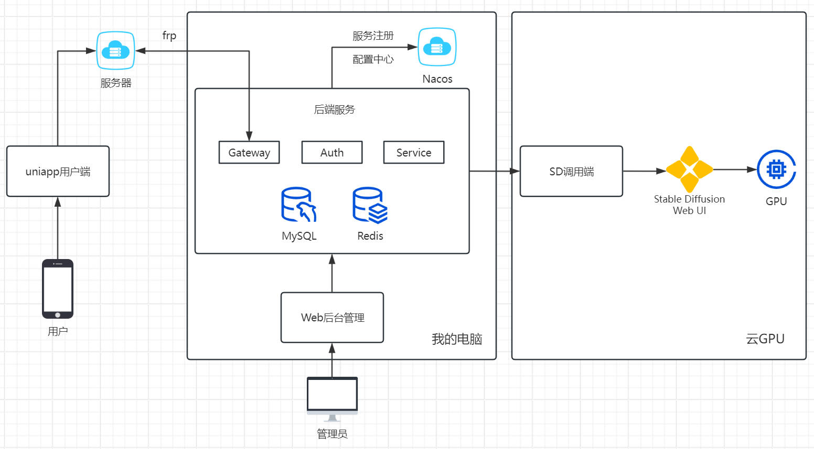



同理增加一个客户端和对应配置即可

客户端 `frpc.ini`

```ini
[sdapi]
type = tcp
local_ip = 127.0.0.1
# 本地SD调用端的端口
local_port = 11777
# 映射到服务器上的某个端口
remote_port = 8001
```

`nginx.conf`

```conf
location /sdapi/ {
    proxy_pass http://127.0.0.1:8001/;
    proxy_set_header X-Real-IP $remote_addr;
    proxy_set_header Host $http_host;
}
```

然后将 nacos 配置中 `huiyu-service-example.json` 的 IP 改成你的域名 `https://api.example.com/sdapi`，将SD调用端 `config.ini` 的 `server_base_url` 改成后端网关地址 `https://api.example.com/huiyu`



------

同理后端服务部署在服务器，仅SD调用端在本地，则只穿透SD调用端即可



## 常见问题

1. 关于QQ机器人相关问题，请前往 [mirai](https://github.com/mamoe/mirai) repo寻找解决方法。
    1. 无法登录 `code=45, title=禁止登录, message=登录失败，请前往QQ官网im.qq.com下载最新版QQ后重试，或通过问题反馈与我们联系。`，[#2570](https://github.com/mamoe/mirai/issues/2570)
    2. 无法向群中推送消息，报错 `Timeout waiting for ConfigPush`，[#2824](https://github.com/mamoe/mirai/issues/2824)、[#2834](https://github.com/mamoe/mirai/pull/2834)
2. 能否不用腾讯云翻译？翻译功能目前仅用于用户生图时输入的中文 Prompt，翻译成英文后便于 Stable Diffusion 理解，如不需要翻译，对应配置留着占位即可，并修改相关代码。 https://github.com/HuiyuAI/huiyu-cloud/blob/d9af671dfed35816fbd0967b4c65136bfac1e80c/huiyu-service/service-core/src/main/java/com/huiyu/service/core/sd/SDCmd2DtoConverter.java#L47-L50
3. 能否不用又拍云存储图片？目前仅实现了该云，但是在后端部分仅用于头像上传的功能，如果不需要，对应配置可留占位，并禁用 https://github.com/HuiyuAI/huiyu-cloud/blob/d9af671dfed35816fbd0967b4c65136bfac1e80c/huiyu-service/service-core/src/main/java/com/huiyu/service/core/controller/UserController.java#L84 但在 SD调用端 模块中依然需要配置又拍云用于上传生成后的图片，因此建议使用。
4. 面部修复功能用不了？Stable Diffusion需要安装插件 [adetailer](https://github.com/Bing-su/adetailer)，并需要用到模型 `face_yolov8n.pt` ，请自行搜索对应教程。已经安装了但 SD调用端 有报错？可能是 webuiapi 库版本不兼容导致，请[到 huiyu-sdapi 仓库中提 issues](https://github.com/HuiyuAI/huiyu-sdapi/issues)。



## LICENSE

[MIT](https://github.com/HuiyuAI/huiyu-cloud/blob/master/LICENSE)



